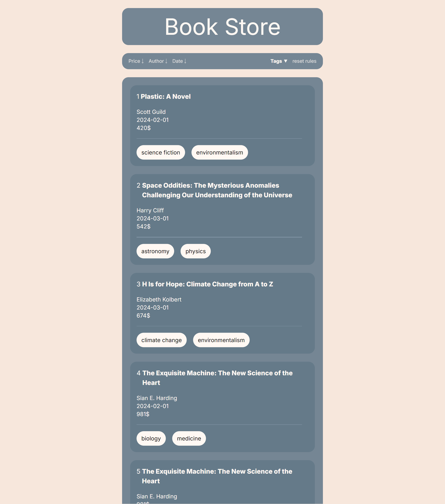

<h1 align="center">Book Store</h1>

Search page with different filter options

# 🚀 Techs

> - [Next.js](https://nextjs.org/docs/getting-started/installation)
> - [React JS](https://reactjs.org/)
> - [TypeScript](https://www.typescriptlang.org/)
> - [Tailwindcss](https://tailwindcss.com/)
> - [Axios](https://axios-http.com/docs/intro)
> - [Fake API com JSON Server](https://www.npmjs.com/package/json-server)

 

  

 

# Running the Project
- Clone repository
  > git clone https://github.com/inacio000/book-store.git
- Install dependencies
  > npm install

## Start Server
  >  json-server -p 3001 db.json
  
  `Or you may test the empty db running the command below` 

  >  json-server -p 3001 db-empty.json

## Run frontend
  > npm start